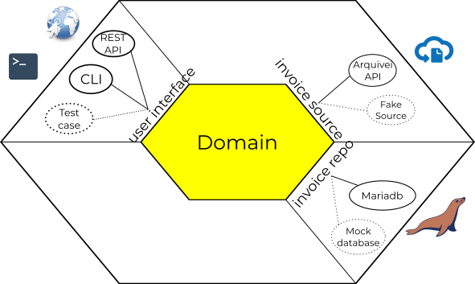

# Bolton Challenge

## Getting started

This project is a solution for the bolton backed challenge at Arquivei.

The goal is integrating with Arquivei's API to fetch a list of
electronic invoices in XML format and populate a relational database with
information from the electronic invoices. Also, provide an api endpoint to consume
the saved data.

This project provides a `docker-compose.yaml` file for convenience, so if you don't have 
`docker` and `docker-compose` installed, got get them. Then, simply run:

    make setup
    
This will set up the containers, install the dependencies, run the quality checks
and automated tests and also create the `.env.local` file. Open this file, and update it
with Arquivei's API credentials:

    ARQUIVEI_API_ID=<put-api-id-here>
    ARQUIVEI_API_KEY=<put-api-key-here>
    ARQUIVEI_API_ENDPOINT=<put-api-endpoint-here>
    
Now we can sync the local database with the electronic invoices returned by
Arquivei's API:

    make sync
    
After the syncing is done we can fetch information about any of the imported invoices:

    curl -X GET http://localhost:8080/api/invoice/<invoice-access-key>    
    
This will give you a json similar to the following:

````json
{
  "access_key": "727272727272727272727",
  "value": 422.34
}
````

### Interacting with the application

There are two ways to interact with the application (three if you count the test cases):

 - API endpoints
 - Console 
 
To see the available endpoints and documentation, visit http://localhost:8080/api/doc

Besides the endpoint, there are two console commands. The first one is `bolton:get-value <access-key>` that
returns the invoice value by its access key. The second command is `bolton:sync-invoices` that is responsible
for syncing the invoices with external sources (Arquivei's API for instance). To use these commands, you will have
to execute them through the default `console` entry point of the application.

    php bin/console bolton:get-value <access-key>
    php bin/console bolton:sync-invoices
    
This was done as a proof of concept for the hexagonal architecture implemented in this project. Technically,
both the API and Console are just adapters for the *User Interface* primary port :).    

## Technical details

### Architecture



The challenge was solved by applying the hexagonal architecture. During the modelling
phase, 3 ports were identified:

 1. *User Interface:* This port is for interacting with the application
 2. *Repository:* This port is for storing and fetching invoice data
 3. *Invoice Source:* This port is for fetching invoice data from external sources in order
 to sync them with the database
 
Besides that, the project is organized in two layers:

 1. *Infrastructure:* All the technology dependent code and the implementation of the
 port adapters
 2. *Domain:* This layer holds the core business logic and concepts and it is totally
 decoupled from the external world
 
Both the Ports and Layers are explicitly defined in code and in the project organization. 
Also worth noting that the *Infrastructure* layer is external and the *Domain* is a 
deeper layer. This is important because the [dependency rule](https://blog.cleancoder.com/uncle-bob/2012/08/13/the-clean-architecture.html),
as presented by Uncle Bob, is being enforced here.

### Testing

This challenge was solved by applying TDD! There are 3 levels of testing:

 1. *System Tests:* These are end-to-end tests, it tries to exercise the system
 from its external published port.
 2. *Integration Tests:* These are tests that exercise the integration with third-party
 code and systems.
 3. *Unit Tests:* These tests exercise a single unit of code, that is usually a single
 class. However, the most import thing to note here is that this type of test does not have
 access to the external world, unlike the *Integration* and *System* tests.

### Quality assurance

In order to ensure a good code quality, the following tools are being applied:

 1. *PHP Code Sniffer:* For enforcing a coding standard
 2. *PHP Stan:* For static code analysis
 3. *Deptrac:* For enforcing the dependency rule between the software layers

### Technologies

This project uses `docker` as a container engine, `docker-compose` to ease
the development and environment set-up. 

Regarding implementation, it uses `php 7.4`
and `symfony 4.4`. The relational database of choice was `mariadb 10`.

